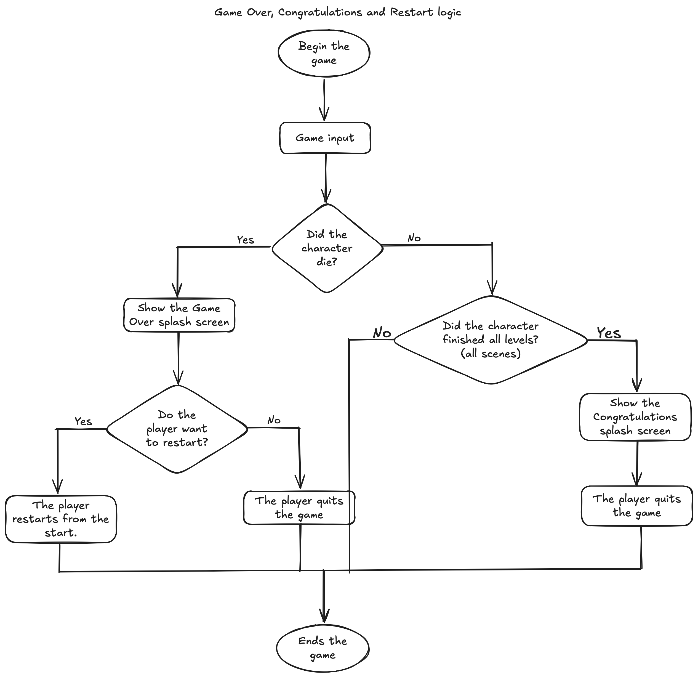

# Identifying and Defining

#### Objective:
My game is going to be MarioRun, my existing 2D platformer game and improving the game playability and the gameplay. This game should demonstrate my knowledge of software technology as I have the capability to find simple errors and fixing it, utilising scripts for further improvement to the game and learning how to make a game.

### Identifying a need :
I think that the need of my game, MarioRun needs improvement in its gameplay overall playability to provide a more engaging and polished, endless, experience for players. Enhancing the game will showcase my software development skills, including debugging, scripting, and creative design. This project also serves as a practical platform to deepen my understanding of game development principles.

### Requirements Outline:
**Inputs:** 
- User controls: keyboard inputs (AWSD or up,down,left,right arrow keys)
- Game events: Obstacles with colliders triggers from collision with the player and should make the character die.

**Processing:**
- The processing is solely on game logic execution. This means handling the character's movement speed, physics, and collider detection when the game is run.

**Outputs:** What outputs will your project produce?
- Visual Display: One of the outputs would be visual display rendering pixelated graphics, animations on the character, and UI elements such as text and buttons mostly on the SplashScreen.

**Transmission:** Will there be any data transmission requirements?
- Unlikely of any data transmissions that is required for my game

**Storage:** What data will need to be stored? 
- At the moment, only the game data files are stored in my laptop in case I want to make even more furthur improvements or to debug an error in my game if their is.


### Functional and Non-Functional Specifications:
#### Functional Specifications
- Player movement: such as running, jumping, and idle (standing still) and other animated obstacles or collectibles.
- Player physics: like physics and collisions using collider in Unity so that the player can interect with obstacles and collectibles
- Game Overs and Restart: The game should detect when the player is defeated and should give options where the player can quit or rety the game
- Should have collectibles that is for the player to collect so that the player can enter the next level.
- Level difficulty: As the player progress through levels it should get slightly harder.

#### Non-Functional Specifications
- Performance: My game should run smoothly without any malfunction or errors.
- Movement: The character should be able to move effortlessly throughout all levels and moving keys should respond almost instantly.
- Scalability: Levels are progressive with a new experience in each and every level.


### Social and Ethical Issues: 
There may be a couple of social and ethical issues as for my game, MarioRun. These are later altered so that gamers can enjoy without having any concerns or worries.

- Addiction and Screen Time: Like many games, MarioRun is a game that encourages the individual to play in their time. This is maybe because my game is engaging and fun. However, this raises concerns about screen time especially for young kids. If I knew more about Unity and how to code, I would've made a set limit amount of time to play on my game or playtime reminders that also increase the game competitivity.

- Content (Is it appropriate?): The game should avoid violent, offensive, or culturally insensitive content. This is an ethical issue that will not be in my game as my game targets young kids. My game have no gorey and sensitive pixel designs and is appropriate to who I am targeting my game to.

- Digital Wellbeing (Does this game pressures players to continue playing?): My game is definitely not grindy,  however it might take some time to be able to complete all the levels made with one life. My game, MarioRun is entertaining, stress relief and is relatively not as difficult to complete as a beginner to 2D platformer games.

#### How will it impact users and society?
- Impact on users and society: MarioRun can impact users positively through skill development, entertainment and stress-relief, and a learning opportunity. Skill development refer to the improvement of hand-eye coordination and reaction time  that can be helpful in the real world. The game being entertaining and calm can help users relax. positively affecting their mental well-being. Lastly, my game can serve as an example on how software and scripting work in game development, providing a learning opportunity.
---


# Researching and Planning

### Evaluation of Existing ideas
**PMI Table: Popular Platformer Games**

| **Game**               | **Plus**                                                                                                                                     | **Minus**                                                                                                                                           | **Implication**                                                                                                                                                     |
|------------------------|----------------------------------------------------------------------------------------------------------------------------------------------|------------------------------------------------------------------------------------------------------------------------------------------------------|----------------------------------------------------------------------------------------------------------------------------------------------------------------------|
| **Sonic the Hedgehog** | Sonic is super fast and exciting, which makes the gameplay feel intense and fun. The music is catchy and the characters are memorable. The levels are colorful and full of energy. | The speed can make it hard to react in time, so players often crash into enemies or obstacles. Some levels feel too short or repetitive. It doesn’t explain things clearly for new players. | Fast gameplay is exciting, but it needs smart level design so players don’t get frustrated. Adding clearer paths and tutorials could help beginners enjoy the game more. |
| **Hollow Knight**      | Hollow Knight has beautiful art and music that create a mysterious and emotional atmosphere. The world is huge and full of secrets. The combat is challenging but fair. | It’s easy to get lost because the map is hard to follow at first. The game doesn’t give much help or direction, and some parts are really hard. | A deep and challenging game can be amazing, but it should also support players with hints or easier options. Helping players learn slowly could make it more enjoyable.    |
| **Super Mario Bros.**  | Super Mario Bros. is easy to understand and play, with fun power-ups and levels that lots of people remember. It’s great for beginners and very replayable. | After a while, the levels can feel the same, and there isn’t much story or character development. The graphics are basic and there’s not much enemy variety. | Simple games are great for learning and having fun, but adding more variety and story could make them more exciting. Updating visuals and features helps keep interest.     |

## Psuedocode and Flowcharts

### Pseudocode 1: Player Movement
````
BEGIN Movement

    INPUT userInput
    IF 'A' or left arrow key is pressed THEN
        Move player right
    ELSE IF 'D' or right arrow key is pressed THEN
        Move player left
    ELSE IF 'Spacebar' or 'W' pressed THEN
        Player jump

END Movement
````

### Psuedocode 2: Player Physics and Collisions
````
BEGIN player physics and collisions

    INPUT PlayermovementInput
    ADD RigidBody2D physics
    Check the charcter for collisions for 2D collider
    IF character collide to another obstacle
        Character moves left
    ELSE IF character collide to another collectible
        Character goes to the next level
    ELSE Character continues movement untill death or next level

END player physics and collisions
````

### Psuedocode 3: Game Over, Congratulations and Restart Logic
````
BEGIN the game

    gameInput
    IF character die
        Show the Game Over splash screen
    ELSE Did the character finish all levels?
        Show the Congratulations splash screen
        The player quits the game

    IF player wants to restart
        The player restarts from the start
    ELSE the player quits the game

END the game
````

### Pseudocode 4: Level Progression
````
BEGIN levels (scenes)
    playermovementInput
    gameInput
    Start at tutorial
    IF player complete level
        The player advance to the next level
        Increased difficulty when leveling up
    ELSE retry the level (scene)

END levels (scenes)
````

### Pseudocode 5: Coin Animation (collectible)
````
BEGIN coin animation

    animationInput
    IF coin is in the scene
        coin animation is shown
    ELSE no coin animation is shown in current scene

END coin animation
````
### Flowcharts

**This flowchart above show the functional requirement of player movement.**


**This flowchart above show the functional requirement of player physics and collisions.**


**This flowchat above show the functional requirement of Game Over, Congratulations and Restart game logic.**


**This flowchart above show the functional requirement of level progression, essential to challenge players and their skills.**


**This flowchart above is a extra functional requirement that affects the collectible. This can also be an obstacle.**

### Storyboards
My storyboards are handed in to Mr Groom because it is on paper. However this storyboard below is the whole game storyboard ⬇️


### Time and Action Plan
This gantt chart shows how I modeled my time to work on the Assessment and at the rest of year, I would be working on my game.
